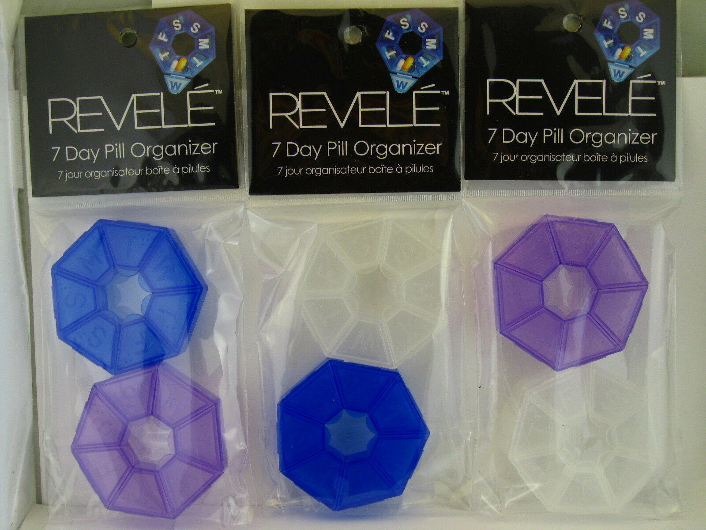

# Drug Monitor (PHP)



An app to plan and organise prescription drug purchases.

For older people on medication, it can be hard to remember what to take, when to take it, and when to re-stock. Drug Monitor helps keep track of all three.

This is the PHP + MySQL version, built to run on standard shared hosting (cPanel). The original Node.js version lives on the `master` branch.

## Built with

- PHP (plain, no framework)
- MySQL / MariaDB (PDO)
- Bootstrap 5

## Features

- Add, edit and delete drugs with a morning / afternoon / evening / night schedule
- Blister packs (cards + packs) or bottles (loose tablets) per drug
- Daily dosage view with colour-coded schedule chips
- Purchase calculator: enter what you already have and it works out what is left to buy, in cards or bottles, for any number of days
- Share the purchase list to a pharmacist by copy, native share sheet, or print
- Optional pack and pill photos per drug, shown in an expandable row
- Barcode scanning on supported phones, with openFDA lookup and manual fallback
- openFDA label warnings shown per drug where available (not medical advice)
- Light and dark theme, mobile friendly

## Requirements

- PHP 7.4 or newer
- MySQL 5.7+ or MariaDB
- The PDO MySQL extension (enabled by default on virtually all hosts)
- Outbound HTTPS via cURL or `allow_url_fopen` (for the openFDA features; the app still works without it, those panels just show nothing)
- A writable `uploads/` folder (for drug photos)
- Barcode scanning needs a supported browser (Chrome/Android) and HTTPS. It works on `localhost` for testing; on a live site you need an SSL certificate.

## Local setup (Laragon)

1. Place the project in `C:\laragon\www\drug-monitor` (already done).
2. Create the database and table. In HeidiSQL or phpMyAdmin, create a database called `drug_monitor`, then import `sql/schema.sql`. Or from the command line:

   ```bash
   mysql -u root -e "CREATE DATABASE drug_monitor CHARACTER SET utf8mb4;"
   mysql -u root drug_monitor < sql/schema.sql
   mysql -u root drug_monitor < sql/seed.sql
   ```

3. Copy the config template and adjust if needed:

   ```bash
   cp config.example.php config.php
   ```

   The defaults (`localhost`, user `root`, empty password) match Laragon out of the box.
4. Open the site at your Laragon URL, for example `http://drug-monitor.test`.

## Deploying to shared hosting (cPanel)

1. In cPanel, create a MySQL database and a database user, then add the user to the database with all privileges.
2. Import `sql/schema.sql` into that database via phpMyAdmin. Optionally import `sql/seed.sql` for a sample drug list.
3. Copy `config.example.php` to `config.php` and fill in your cPanel database name, user and password. Note that cPanel usually prefixes them, for example `myacct_drugmonitor`.
4. Upload the whole project into `public_html` (or a subfolder) using the File Manager or FTP.
5. Make sure the `uploads/` folder is writable (permissions 755, or 775 if needed) so drug photos can be saved.
6. Visit your domain. That's it, no build step and no Node required.

`config.php` holds your database credentials and is git-ignored, so it never gets committed.

## Note on the database

The Node.js version used MongoDB. This version uses MySQL, since shared hosting supports MySQL rather than MongoDB. Existing Mongo data does not carry over automatically; re-enter drugs through the Add Drug form, or import them into the `drugs` table directly.

## Author

Peter Banigo

## Licence

ISC
